# social-network-api

exploring backend development with MongoDB

## Description

This project explores backend development for a social media app in MongoDB using Mongoose. I created all CRUD routes for users and their thoughts, as well as routes to link users to other users (friends) and users' reactions to other users' thoughts.

## Demonstrations

This demonstration shows the server being started and all routes functioning.

https://github.com/MelissaCade/social-network-api/assets/160056156/0d2dc731-d7ce-43ff-bb1e-7f44829a6477

## Screenshots

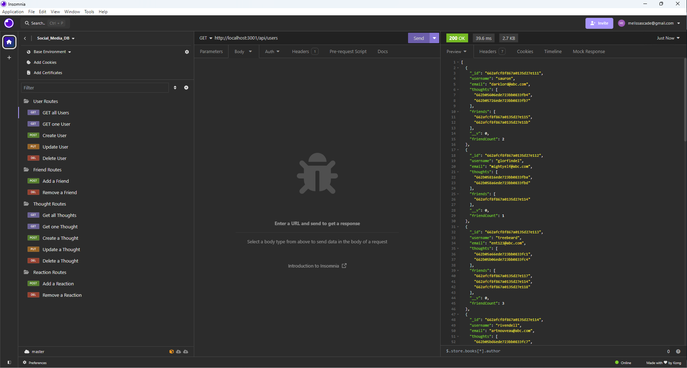

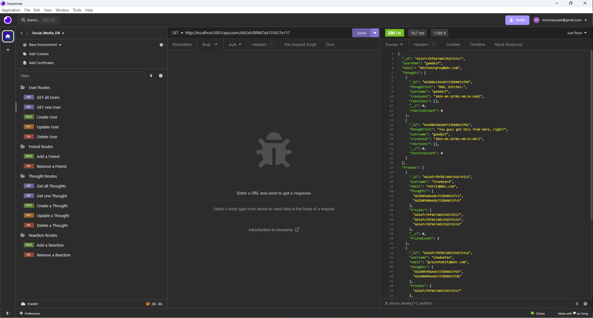

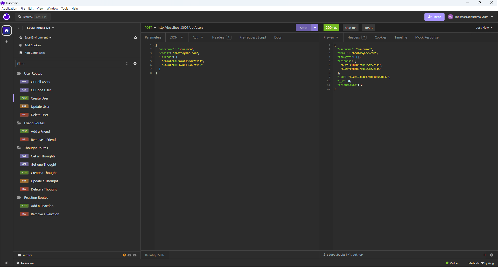

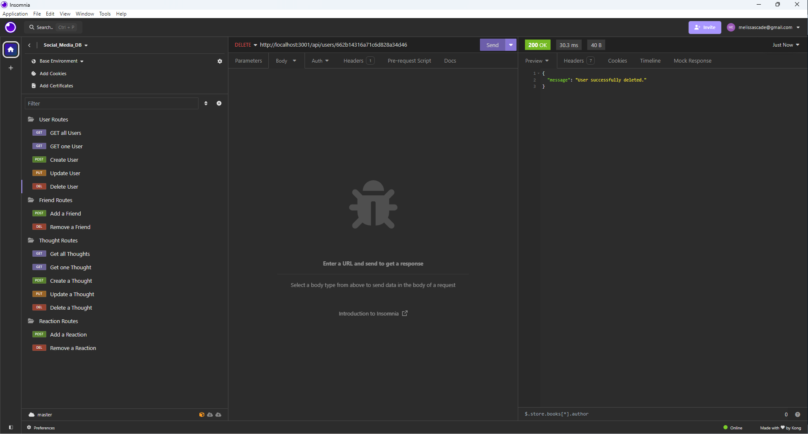

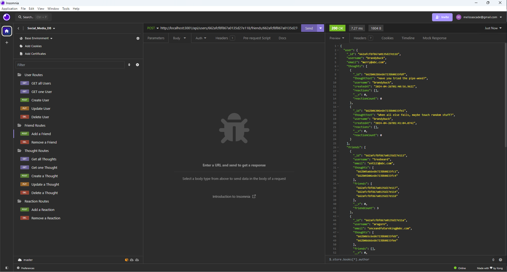

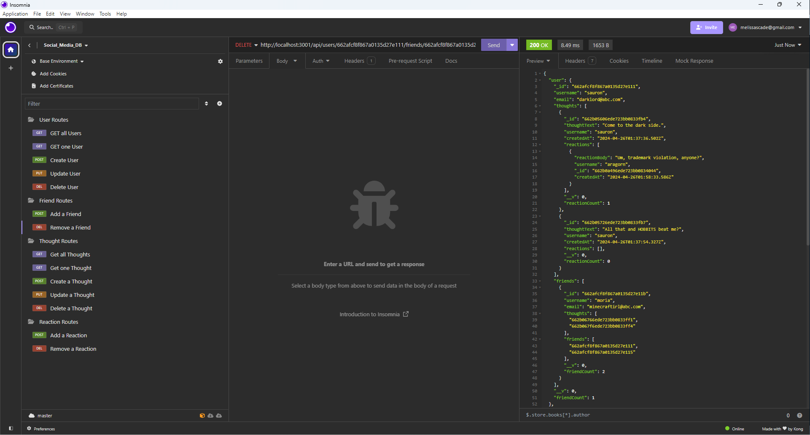

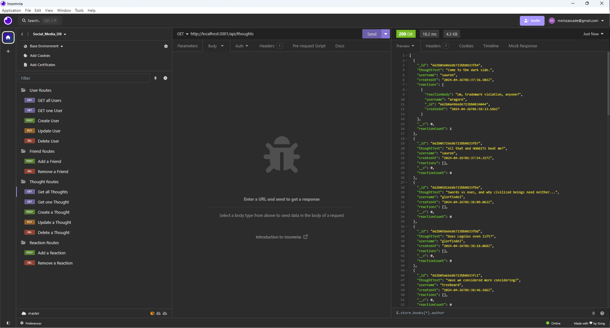

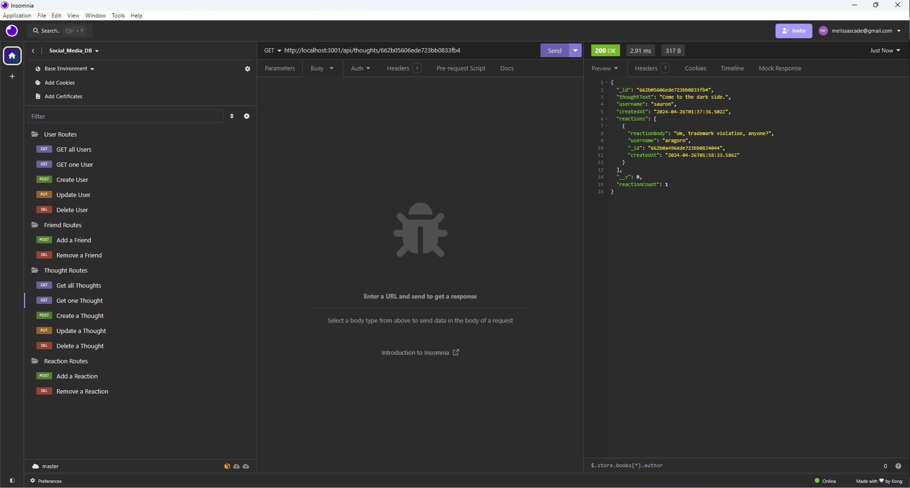

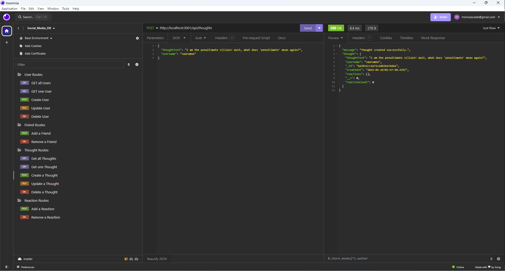

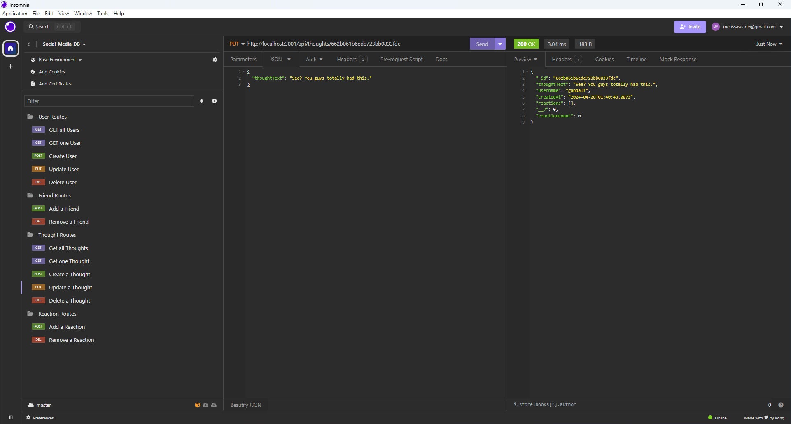

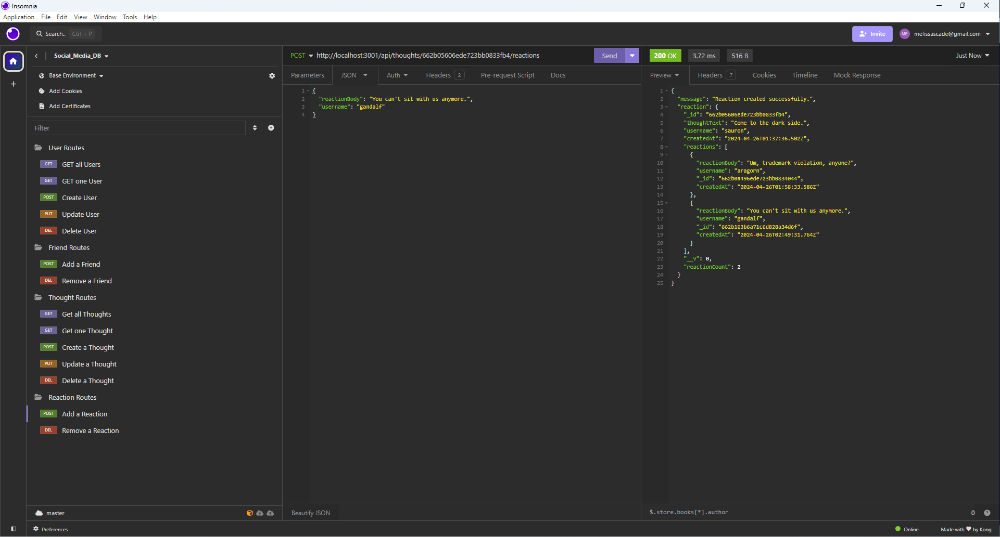

## Installation

Make sure you have both Insomnia and MongoDB Compass installed on your computer for the most efficient viewing and interacting with the database.

Navigate to the project directory and use "npm i" in your terminal to install all necessary node packages.

In the terminal, type "nodemon index.js" to start the server and connect to the database.

## Usage

NOTE: This project comes with a small amount of user seed data, which you can install using "npm run seed" in your terminal, but once your database is seeded it is better to create your own users, thoughts, friendships, and reactions using insomnia and the routes provided. 

To create a user, 

## Links

## Credits

This page uses the materials and resources provided in the University of Denver Coding Bootcamp. My tutor through DUBC, Eric, was especially helpful.

I also used the following websites as reference to figure out how to do everything:

stack overflow - https://stackoverflow.com/  
free code camp - https://www.freecodecamp.org/  
geeks for geeks - https://www.geeksforgeeks.org/  
mdn web docs - https://developer.mozilla.org/en-US/  
w3schools - https://www.w3schools.com/
