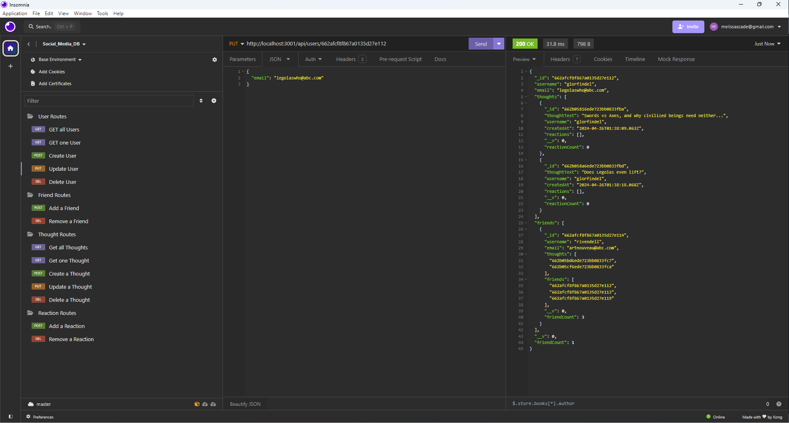

# social-network-api

exploring backend development with MongoDB

## Description

This project explores backend development for a social media app in MongoDB using Mongoose. I created all CRUD routes for users and their thoughts, as well as routes to link users to other users (friends) and users' reactions to other users' thoughts.

## Demonstrations

This demonstration shows the server being started and all routes functioning.

https://github.com/MelissaCade/social-network-api/assets/160056156/0d2dc731-d7ce-43ff-bb1e-7f44829a6477

## Screenshots

Get all users:

Get one user:

Create a user:

Update a user:

Delete a user:

Add a friendship:

Remove a friendship:

Get all thoughts:

Get one thought:

Create a thought:

Update a thought:

Delete a thought:

Add a reaction to a thought:

Remove a reaction from a thought:

## Installation

Make sure you have both Insomnia and MongoDB Compass installed on your computer for the most efficient viewing and interacting with the database.

Navigate to the project directory and use "npm i" in your terminal to install all necessary node packages.

In the terminal, type "nodemon index.js" to start the server and connect to the database.

## Usage

NOTE: This project comes with a small amount of user seed data, which you can install using "npm run seed" in your terminal, but once your database is seeded it is better to create your own users, thoughts, friendships, and reactions using insomnia and the routes provided.

Follow these routes, and use the included JSON body objects when applicable, to interact with the database in Insomnia:

(GET) Get all users: http://localhost:3001/api/users

(GET) Get one user: http://localhost:3001/api/users/:userId (here, ":userId" represents the ID number of whichever user you wish to see.)

(POST) Create a user: http://localhost:3001/api/users

`{
	"username": "anduin",
	"email": "longriver@abc.com"
}`

(PUT) Update a user: http://localhost:3001/api/users/:userId (here, ":userId" represents the ID number of whichever user you wish to update.)

`{
	"email": "legolaswho@abc.com"
}`

(DEL) Delete a user: http://localhost:3001/api/users/:userId (here, ":userId" represents the ID number of whichever user you wish to delete.)
NOTE: When a user is deleted, their associated thoughts are also deleted.

(POST) Add a friend: http://localhost:3001/api/users/:userId/friends/:friendId (":userId" represents the ID of the first user in our friendship, and ":friendId" represents the second. Both users will be updated to show a mutual friendship.)

(DEL) Remove a friend: http://localhost:3001/api/users/:userId/friends/:friendId (":userId" represents the ID of the first user in our friendship, and ":friendId" represents the second. Both users will be updated to remove the friendship.)

(GET) Get all thoughts: http://localhost:3001/api/thoughts

(GET) Get one thought: http://localhost:3001/api/thoughts/:thoughtId (":thoughtId" is the ID number of whichever thought you wish to see.)

(POST) Create a thought: http://localhost:3001/api/thoughts

`{
	"thoughtText": "I am the penultimate villain! Wait, what does 'penultimate' mean again?",
	"username": "saurumon"
}`

(PUT) Update a thought: http://localhost:3001/api/thoughts/:thoughtId (":thoughtId" is the ID number of whichever thought you wish to update.)

`{
	"thoughtText": "See? You guys totally had this."
}`

(DEL) Delete a thought: http://localhost:3001/api/thoughts/:thoughtId (":thoughtId" is the ID number of whichever thought you wish to delete.)

(POST) Add a reaction: http://localhost:3001/api/thoughts/:thoughtId/reactions (":thoughtId" is the ID number of whichever thought you wish to react to.)

`{
	"reactionBody": "You can't sit with us anymore.",
	"username": "gandalf"
}`

(DEL) Remove a reaction: http://localhost:3001/api/thoughts/:thoughtId/reactions/:reactionId (":thoughtId" is the ID number of whichever thought you wish to remove the reaction from. ":reactionId" is the ID number of the reaction you wish to remove.)

The user can create as many users, friendships, thoughts, and associated reactions as they choose.

## Links

GitHub Repository: https://github.com/MelissaCade/social-network-api

## Credits

This page uses the materials and resources provided in the University of Denver Coding Bootcamp. My tutor through DUBC, Eric, was especially helpful.

I also used the following websites as reference to figure out how to do everything:

stack overflow - https://stackoverflow.com/  
free code camp - https://www.freecodecamp.org/  
geeks for geeks - https://www.geeksforgeeks.org/  
mdn web docs - https://developer.mozilla.org/en-US/  
w3schools - https://www.w3schools.com/
